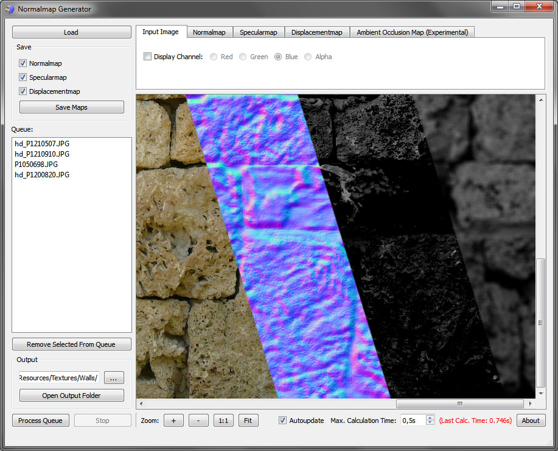
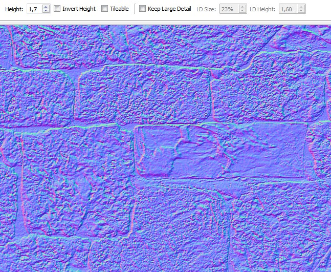
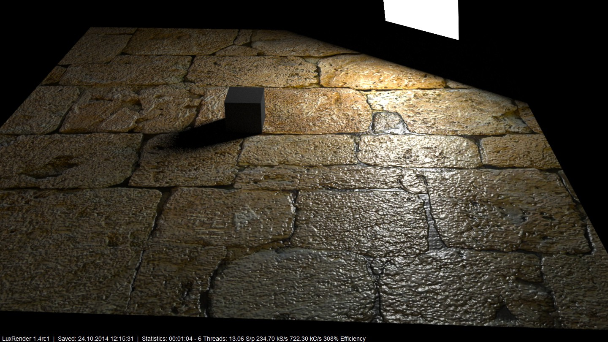
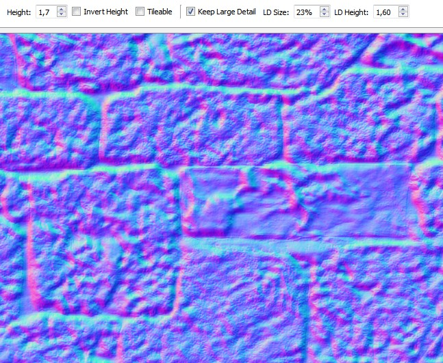
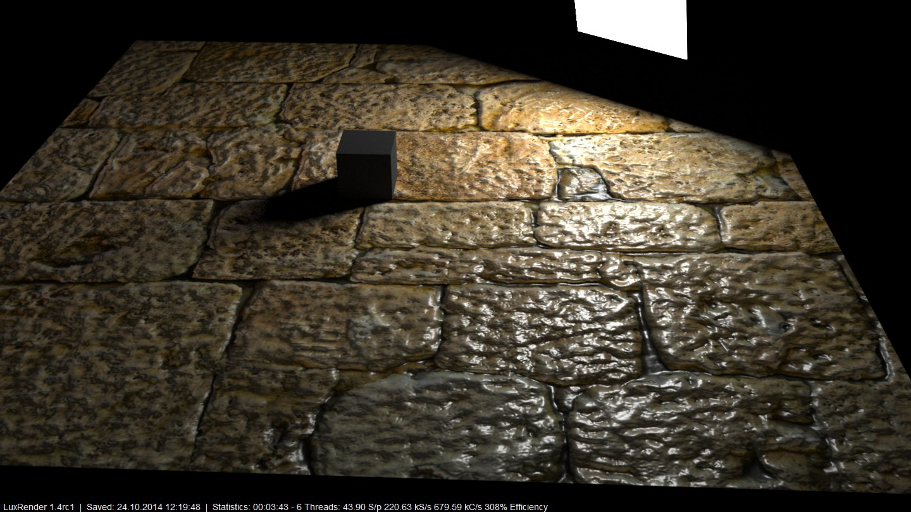

This is a program to generate normal-, spec- and displacementmaps from image textures in one go. It supports stack processing and a few other nice features, but has some rough edges and is still in development. 

## Features

- Fully multithreaded with OpenMP, will use all available CPU cores
- Keep Large Detail (see below for details)
- Fast and easy way to create normal, spec and displacementmaps

### Keep Large Detail

One of the things I hate about classic normalmap generators is how they handle large image textures: usually the normalmap is unusable due to fine detail and the whole information about "large detail" (the overall curvature) is lost.

This is a large texture generated the classic way:

When used in a rendering, it will look like this:

What the feature I called "Keep Large Detail" does is that it blends a downscaled version of the image over the original image, thus retaining the overall curvature information while still showing fine detail:

Rendered, it looks much better:

## Planned Features

- Better blurring algorithm for displacementmaps
- Ambient occlusion maps
